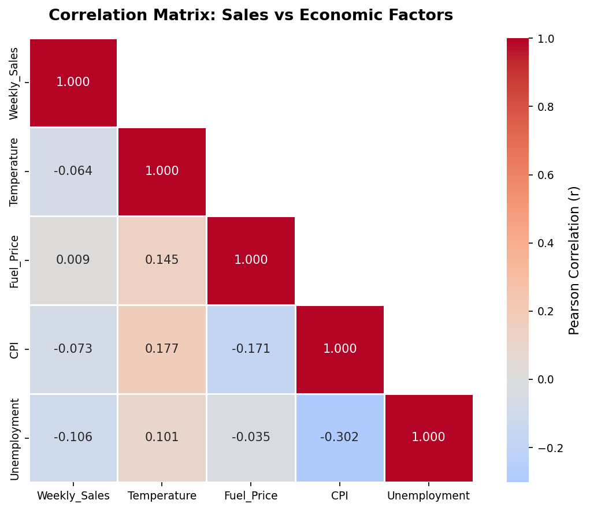
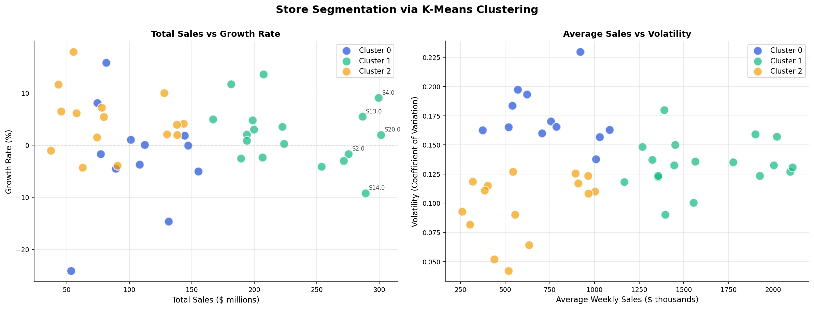
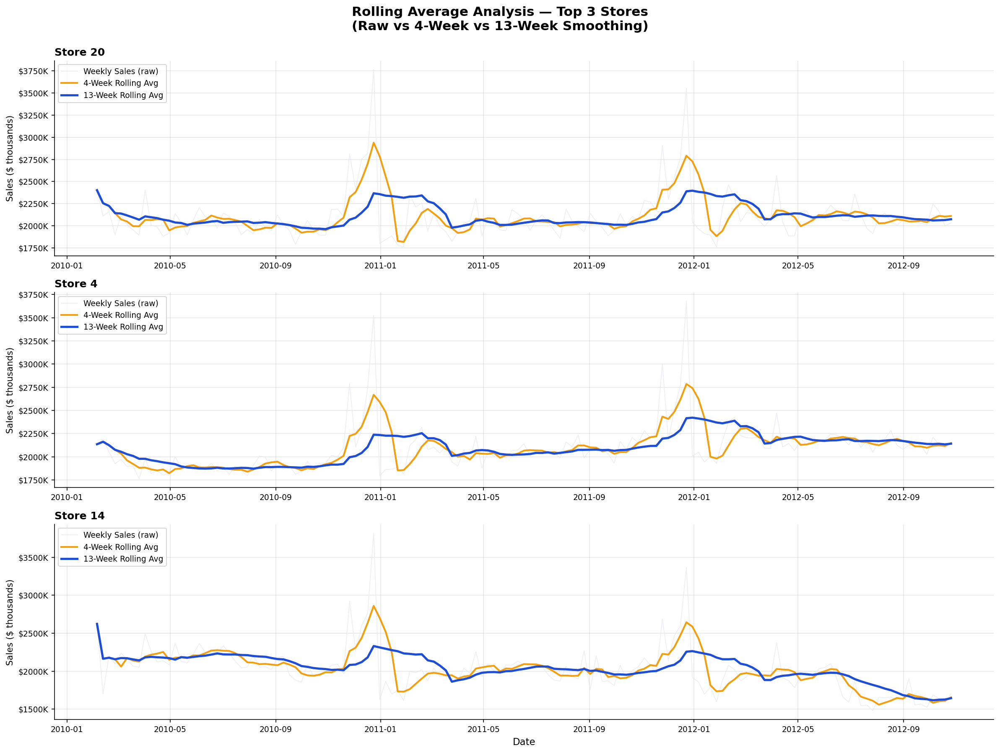

# 🛒 Walmart Sales Analysis & Business Intelligence


---

## 📊 Overview

Comprehensive data analytics project analyzing Walmart retail store sales across 45 locations between 2010 and 2012.

This project focuses on:

* Exploratory Data Analysis (EDA)
* Business Intelligence & Reporting
* Statistical Analysis
* Store Segmentation
* Seasonal Trend Analysis
* Economic Correlation Analysis
* Strategic Business Insights

The goal is to uncover operational patterns, identify sales drivers, measure holiday impact, and provide actionable retail recommendations.

---

## 🎯 Key Findings

| Insight              | Value                                        |
| -------------------- | -------------------------------------------- |
| Dataset Size         | 6,435 weekly sales records                   |
| Analysis Period      | February 2010 – October 2012                 |
| Stores Analyzed      | 45 retail stores                             |
| Top Performing Store | Store 20                                     |
| Holiday Impact       | +7.8% average uplift                         |
| Peak Season          | December                                     |
| Economic Insight     | Sales negatively correlate with unemployment |

---

## 📁 Project Structure

```bash
walmart-sales-analysis/
│
├── data/
│   ├── raw/
│   │   └── Walmart.csv
│   └── processed/
│       └── walmart_sales_clean.csv
│
├── notebooks/
│   ├── 01_data_understanding.ipynb
│   ├── 02_sales_analysis.ipynb
│   ├── 03_data_cleaning.ipynb
│   ├── 04_eda_basic.ipynb
│   ├── 05_eda_advanced.ipynb
│   └── 06_business_insights.ipynb
│
├── reports/
│   ├── figures/
│   └── executive_summary.md
│
├── requirements.txt
├── README.md
└── .gitignore
```

---

## 🚀 Quick Start

### 1️⃣ Clone the Repository

```bash
git clone https://github.com/Dina-Atef12/walmart-sales-analysis.git
cd walmart-sales-analysis
```

### 2️⃣ Create Virtual Environment

#### Windows

```bash
python -m venv venv
venv\Scripts\activate
```

#### macOS / Linux

```bash
python3 -m venv venv
source venv/bin/activate
```

### 3️⃣ Install Dependencies

```bash
pip install -r requirements.txt
```

### 4️⃣ Launch Jupyter Notebook

```bash
jupyter notebook
```

---

## 📓 Notebook Workflow

| Notebook                | Purpose                                          |
| ----------------------- | ------------------------------------------------ |
| 01 — Data Understanding | Dataset structure, missing values, profiling     |
| 02 — Sales Analysis     | Revenue trends and store performance             |
| 03 — Data Cleaning      | Cleaning, preprocessing, feature engineering     |
| 04 — Basic EDA          | Distributions, seasonal trends, holiday analysis |
| 05 — Advanced EDA       | Rolling averages, clustering, correlations       |
| 06 — Business Insights  | Strategic recommendations and conclusions        |

> Recommended execution order: 01 → 06

---

## 🔍 Analysis Highlights

### 📈 Sales Trend Analysis

* Weekly and monthly sales trend exploration
* Seasonal demand pattern identification
* Rolling average smoothing for trend clarity

### 🏬 Store Segmentation

* KMeans clustering for store grouping
* Revenue and volatility-based segmentation
* Peer benchmarking analysis

### 🎄 Holiday Impact Analysis

* Holiday vs non-holiday sales comparison
* Statistical significance testing
* Seasonal uplift measurement

### 🌍 Economic Correlation Analysis

* Relationship between sales and:

  * Unemployment
  * CPI
  * Fuel Prices
  * Temperature

### 📊 Statistical Analysis

* Correlation matrices
* Hypothesis testing
* Distribution analysis
* Outlier identification

---

## 📊 Sample Visualizations

### Store Performance Ranking


### Holiday Sales Impact


### Correlation Heatmap



### Store Clustering



### Rolling Average Trends



---

## 🛠️ Technologies Used

| Category      | Tools                       |
| ------------- | --------------------------- |
| Programming   | Python                      |
| Data Analysis | Pandas, NumPy               |
| Visualization | Matplotlib, Seaborn, Plotly |
| Statistics    | SciPy                       |
| Clustering    | Scikit-learn (KMeans)       |
| Environment   | Jupyter Notebook            |
| Profiling     | ydata-profiling             |

---

## 💡 Business Insights

* Holiday periods significantly increase weekly sales
* Q4 consistently outperforms other quarters
* Sales are moderately affected by macroeconomic indicators
* Revenue distribution varies substantially across stores
* Cluster-based strategies improve operational targeting

---

## ✅ Project Scope

### Included

* Exploratory Data Analysis (EDA)
* Advanced Visualization
* Statistical Testing
* Store Clustering
* Business Intelligence Reporting
* Strategic Recommendations

### Not Included

* Machine Learning Prediction
* Forecasting Models
* Classification Models
* Deep Learning

> This is a pure analytics and business intelligence project.

---

## 📧 Contact

**Dina Atef Ramadan**
GitHub: https://github.com/Dina-Atef12
LinkedIn: https://www.linkedin.com/in/dina-atef-6a203b37a
Email: [dinaatef4422@gmail.com](mailto:dinaatef4422@gmail.com)

---

## 📄 License

This project is licensed under the MIT License.

---

## 🙏 Acknowledgments

* Dataset Source: Walmart Sales Dataset (Kaggle)
* Inspired by real-world retail analytics workflows

---

⭐ If you found this project useful, feel free to star the repository.
